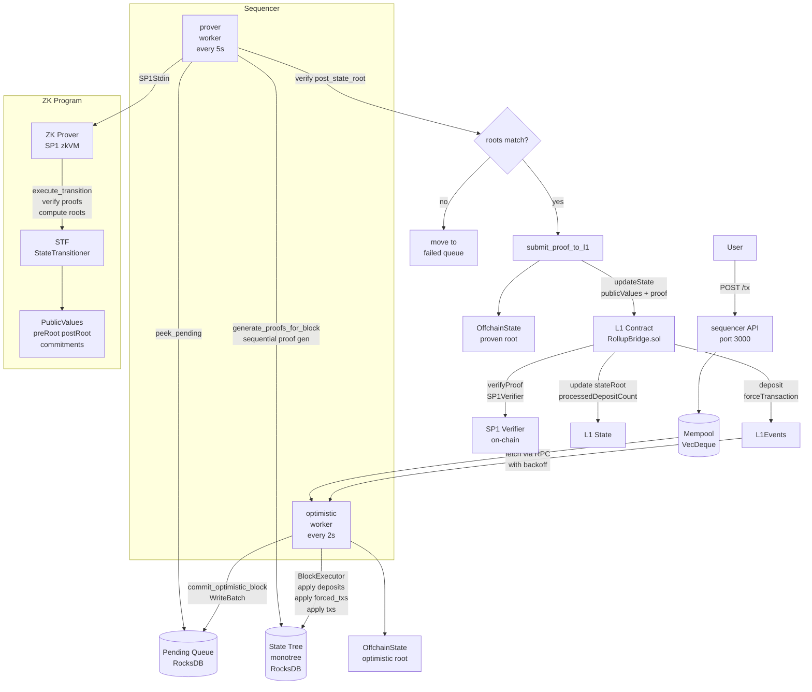

# tiny-sp1-rollup

building tiny L2 rollup with SP1 zkVM by succinct  

### about 
there is a deployable `L1 validator contract (RollupBridge.sol)` that accepts `deposits` and relays them to the `sequencer`    
then the `sequencer` collects batches (2 seconds), creating a block, passing to `optimistic execution worker` to get a soft confirmation (deposits->forced txs->common txs)    
then the `prover worker` generates proofs using a `sparse merkle tree (SMT)`    
then writing block data and merkle proofs to the separate `zkVM program`    
the guest vm reads all passed data and calls the `state transition function` to execute same financial operations in the secure environment    
returns PublicValues - pre-state root, post-state root and deposits/forced txs commitments (28 bytes for hash, 4 bytes for count)    
using generated zk-proof to synchronize and confirm state correctness and passing it to L1 contract to move a pointer of handled l1 txs  
do not need full common L2 txs data in the public values cuz L1 trusts post-state root - "im, l2 sequencer, took the pre-state root, got some l2 txs from the mempool and here's a post-state root after using my state transition function "  

maybe this can be called a `message bridge` (not like layerzero but a state proving validity bridge)    
or a l1 light client - just checking the validity of state transition in l2 but do not executing it itself (trusting zk math)    
there are some types of bridges (or rollups) and this one falls under the category of a zk-rollup    
bundles(rolls up) txs off-chain in the sequencer, executes them and submits a cryptographic proof of validity to the main chain    

have to sequentially apply+proof all ops in the block    
cannot calculate the final state and only then get a proof - wont be possible to confirm in zk program    
cuz we dont have a full tree  

used monotree crate for sparse merkle trees    
not sure its suitable for production cuz of &mut self API so have to implement it from scratch to get a more granular locking strategy?    

* using automatic `program` build.rs from succint docs
* have a config/default.toml + .env  
* atomic commits for new blocks with rocksdb's WriteBatch
* using sha3_256 for account hash and hash_nodes for a merkle tree  
* keccak256 for hash_deposits and hash_forced_txs cuz they will be checked by the L1
* a couple of proptests for stf

### arch
* stf - no_std core library used by every other crate. types like account, transcation, deposit, forced tx. logic of applying txs, merkle tree logic, zk entrypoint (execute_transition), l1 commitments logic
* program - zk guest vm, runs inside sp1
* core - offchain utils, has access to rocksdb, there is a BlockExecutor which applies a block to the state tree with account_cache optimization to prevent rocksdb reading bottleneck, generate_proofs_for_block fn seqentially generates merkle proofs, build_stf_proof fn fetches an account + merkle path from monotree
* sequencer - the main binary with axum http api and 2 background workers - optimistic (mempool watcher) and prover (pending blocks watcher). persistence module for pending and failed blocks storage
* script - standalone cli tools. main loads pending blocks, generates proofs, runs execute test. evm generates a groth16/plonk proofs but just left the original version from the example sp1 repo. vkay prints the program verification key (also can get it from the console)



### todo:
* cleanup with cargo tree -d
* handle proof mismatch
* reclaimDeposit
* use blake2b/blake3 instead of sha3?
* add api /tx signature validation
* review and optimize solidity contract
* add tracing instead of println
* try to add more parallel stuff and recheck tree batching
* missing tests

spent ~2 weeks on this project and got kinda tired and lazy to properly test    
have to:  
* deploy a l1 contract, test locally with anvil and  
* cast send --rpc-url http://localhost:8545 --private-key PRIV_KEY BRIDGE_ADDR "deposit(uint256)" 1000000000000000000  
* then try to curl tx

notes for my future self:  
```
cd crates/sequencer
cargo run
(wait for setup)

curl -X POST http://localhost:3000/tx \
-H "Content-Type: application/json" \
-d '{
  "from": [1,0,0,0,0,0,0,0,0,0,0,0,0,0,0,0,0,0,0,0,0,0,0,0,0,0,0,0,0,0,0,0],
  "to":   [2,0,0,0,0,0,0,0,0,0,0,0,0,0,0,0,0,0,0,0,0,0,0,0,0,0,0,0,0,0,0,0],
  "nonce": 0,
  "fee": 1,
  "amount": 100
}'

curl -X POST http://localhost:3000/tx \
-H "Content-Type: application/json" \
-d '{
  "from": [1,0,0,0,0,0,0,0,0,0,0,0,0,0,0,0,0,0,0,0,0,0,0,0,0,0,0,0,0,0,0,0],
  "to":   [3,0,0,0,0,0,0,0,0,0,0,0,0,0,0,0,0,0,0,0,0,0,0,0,0,0,0,0,0,0,0,0],
  "nonce": 1,
  "fee": 1,
  "amount": 50
}'

crates/sequencer/db/queues/pending for pending/failed blocks
crates/sequencer/db/state_tree a db
```

# default sp1 readme

A minimal ZK-Rollup built on the SP1 zkVM from [Succinct](https://succinct.xyz/).

This project is a learning exercise to build a complete L2 system, including an L1 bridge, a `no_std` state-transition function, a zkVM guest program, and a sequencer.

## Architecture

-   `contracts/`: L1 Solidity contracts managed by Foundry.
-   `crates/`: Rust workspace.
    -   `stf`: The State Transition Function (L2 logic) in `no_std` Rust.
    -   `program`: The guest program that runs inside the SP1 zkVM.
    -   `sequencer`: The L2 node that orders transactions and submits proofs to L1.

## Prerequisites

1.  **Rust:** Install from rustup.rs.
2.  **Foundry:** Install from getfoundry.sh.
3.  **SP1 Toolchain:** Install `sp1up` and the `succinct` toolchain.
    ```bash
    curl -L https://sp1up.succinct.xyz | bash
    sp1up
    ```

## Setup

1.  Clone the repository.
2.  Install Solidity dependencies:
    ```bash
    forge install
    ```
3.  Build the Rust crates (this will also download all Rust dependencies):
    ```bash
    cargo build
    ```